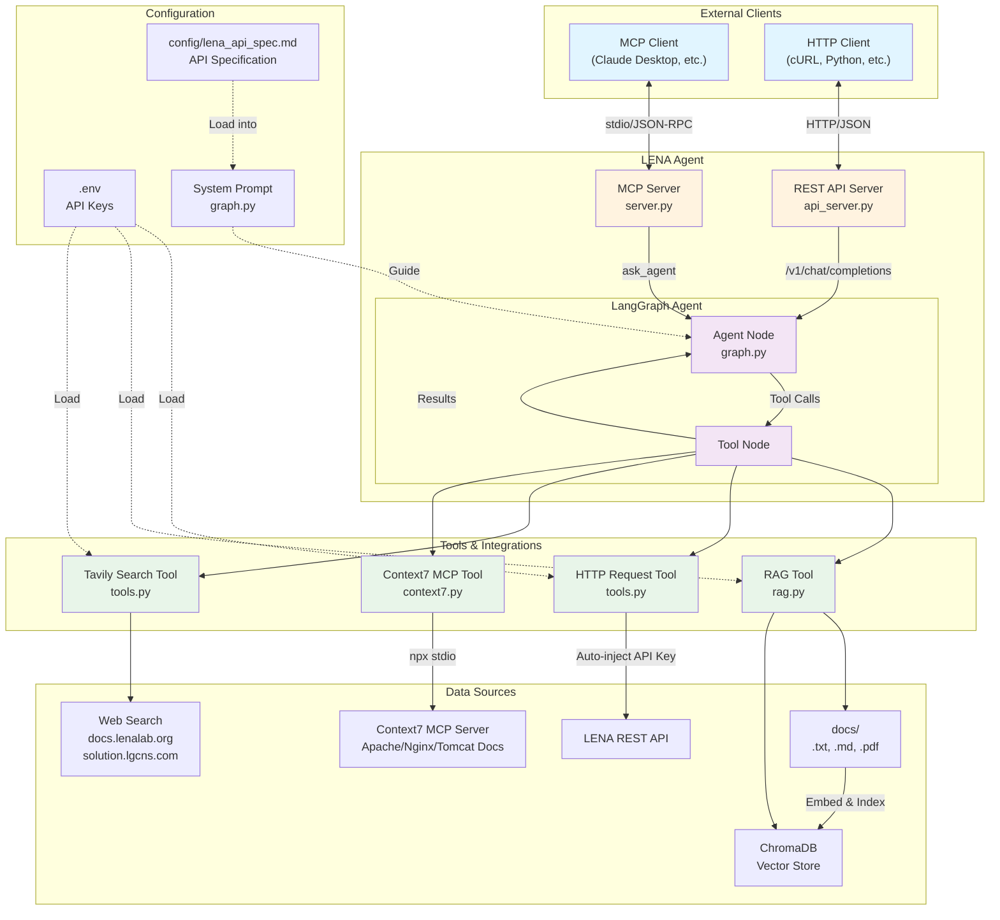

# LENA Agent

**LangGraph 기반 AI 에이전트** - RAG, HTTP 요청, 웹 검색, Context7 MCP 통합

이 프로젝트는 **MCP 서버** (Claude Desktop용) 또는 **REST API 서버** (범용 HTTP 클라이언트용)로 동작합니다.

> 📖 **상세 설치 가이드**: [INSTALL.md](INSTALL.md)

## 📐 아키텍처 (Architecture)



### 주요 구성 요소

* **2가지 서버 모드**:
  * **MCP Server**: Claude Desktop 등 MCP 클라이언트와 stdio로 통신
  * **REST API Server**: HTTP 클라이언트와 OpenAI 호환 API로 통신
* **LangGraph Agent**: 사용자 질문을 분석하고 적절한 도구를 선택
* **4가지 도구**:
  * **RAG**: 내부 문서 검색 (txt/md/pdf → ChromaDB)
  * **HTTP**: LENA REST API 호출 (자동 키 주입)
  * **Tavily**: 특정 도메인 웹 검색
  * **Context7**: Apache/Nginx/Tomcat 문서 검색
* **설정 파일**:
  * `.env`: API 키 및 URL
  * `config/lena_api_spec.md`: API 명세 (시스템 프롬프트에 로드)

---

## 🚀 빠른 시작 (Quick Start)

### Option 1: Git에서 직접 설치 (가장 간단)

```bash
# Git 저장소에서 설치
uv tool install git+https://github.com/username/lena-agent.git

# .env 파일 설정 (프로젝트 폴더에서)
cp .env.example .env
# .env 파일을 편집하여 API 키 입력
```

**사용:**

```bash
# MCP 서버 실행
lena-agent

# REST API 서버 실행
lena-agent-api
```

### Option 2: 로컬 클론

```bash
# 저장소 클론
git clone https://github.com/username/lena-agent.git
cd lena-agent

# 환경 변수 설정
cp .env.example .env  # Linux/Mac
Copy-Item .env.example .env  # Windows PowerShell
# .env 파일을 편집하여 실제 API 키 입력

# 의존성 설치
uv sync

# MCP 서버 실행
uv run server.py

# 또는 REST API 서버 실행
uv run api_server.py
```

### Option 3: Docker Compose

```bash
# MCP 서버 실행
docker compose up lena-agent --build

# 또는 REST API 서버 실행
docker compose up lena-agent-api --build
```

---

## 🌐 REST API 사용 (REST API Usage)

OpenAI API와 호환되는 HTTP REST API를 제공합니다.

### API 서버 실행

**Docker Compose:**

```bash
docker compose up lena-agent-api --build
```

**로컬 실행:**

```bash
uv sync
uv run api_server.py
```

서버는 `http://localhost:8000`에서 실행됩니다.

### API 엔드포인트

#### POST /v1/chat/completions

**요청 예시 (cURL):**

```bash
curl -X POST http://localhost:8000/v1/chat/completions \
  -H "Content-Type: application/json" \
  -d '{
    "messages": [
      {"role": "user", "content": "LENA에 대해 알려줘"}
    ]
  }'
```

**요청 예시 (Python):**

```python
import requests

response = requests.post(
    "http://localhost:8000/v1/chat/completions",
    json={
        "messages": [
            {"role": "user", "content": "LENA에 대해 알려줘"}
        ]
    }
)

result = response.json()
print(result["choices"][0]["message"]["content"])
```

**응답 형식:**

```json
{
  "id": "chatcmpl-1234567890",
  "object": "chat.completion",
  "created": 1234567890,
  "model": "lena-agent",
  "choices": [
    {
      "index": 0,
      "message": {
        "role": "assistant",
        "content": "LENA는..."
      },
      "finish_reason": "stop"
    }
  ],
  "usage": {
    "prompt_tokens": 0,
    "completion_tokens": 0,
    "total_tokens": 0
  }
}
```

#### GET /v1/models

사용 가능한 모델 목록을 반환합니다.

#### GET /

헬스 체크 엔드포인트입니다.

---

## 🔌 MCP 클라이언트 연결 (MCP Client Configuration)

### Claude Desktop 설정

설정 파일 위치:

* **Windows**: `%APPDATA%\Claude\claude_desktop_config.json`
* **macOS**: `~/Library/Application Support/Claude/claude_desktop_config.json`
* **Linux**: `~/.config/Claude/claude_desktop_config.json`

설정 파일에 추가:

```json
{
  "mcpServers": {
    "lena-agent": {
      "command": "uv",
      "args": ["--directory", "F:/HttpRequestAgent", "run", "server.py"],
      "env": {
        "OPENAI_API_KEY": "sk-...",
        "TAVILY_API_KEY": "tvly-...",
        "LENA_API_URL": "http://...",
        "LENA_API_KEY": "..."
      }
    }
  }
}
```

---

## 🎯 주요 기능 (Features)

### RAG (문서 기반 답변)

* 내부 문서(`docs/` 폴더)를 검색하여 질문에 답변
* **지원 파일**: `.txt`, `.md`, `.pdf`
* **하이브리드 검색**: BM25(키워드) + Vector(의미) 결합
* **캐싱**: 벡터 DB(`chroma_db/`)를 자동으로 저장하여 재시작 시 빠르게 로드
  * 첫 실행: 문서 임베딩 (10~30초)
  * 재실행: 캐시 로드 (0.5초 이내)
* **옵션**: `RAG_ENABLE_RERANK=true`로 Re-ranking 활성화 (정확도↑, 속도↓)

### HTTP 요청

* LENA REST API 호출 시 자동으로 API 키 주입 (`?key=...`)

### 웹 검색 (Tavily)

* 특정 도메인(`docs.lenalab.org`, `solution.lgcns.com`) 검색

### Context7 통합

* Apache, Nginx, Tomcat 문서 검색

### LENA API 설정

1. `.env`에 `LENA_API_URL`과 `LENA_API_KEY` 추가
2. `config/lena_api_spec.md`에 API 엔드포인트 정의
3. 에이전트가 자동으로 적절한 API 선택 및 호출

---

## 🧪 테스트

```bash
uv run test_agent.py
```

4가지 시나리오 테스트:

1. RAG: 내부 문서 검색
2. HTTP: 외부 API 호출
3. Tavily: 웹 검색
4. Context7: Apache/Nginx/Tomcat 문서 검색

---

## ⚠️ 트러블슈팅

### Tavily 401 에러

* `.env` 파일에 `TAVILY_API_KEY` 확인
* `OPENAI_API_KEY` 확인 (RAG 사용 시 필수)
