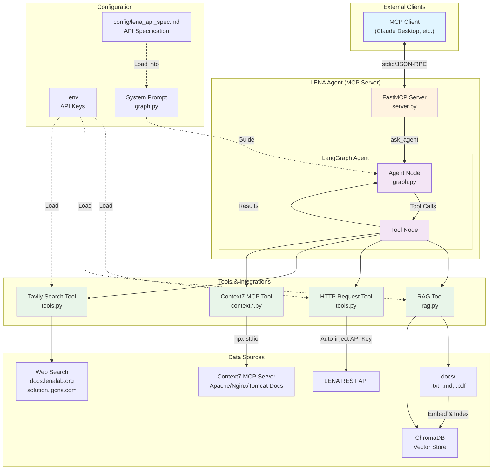

# LENA Agent 사용 가이드

이 프로그램은 LangGraph를 기반으로 구축된 AI 에이전트로, RAG(검색 증강 생성), HTTP 요청, 웹 검색, 그리고 Context7 MCP 통합 기능을 제공하며, 전체가 MCP(Model Context Protocol) 서버로 동작합니다.

## 📐 아키텍처 (Architecture)



### 주요 구성 요소

* **MCP Server**: FastMCP를 통해 외부 클라이언트와 통신
* **LangGraph Agent**: 사용자 질문을 분석하고 적절한 도구를 선택
* **4가지 도구**:
  * **RAG**: 내부 문서 검색 (txt/md/pdf → ChromaDB)
  * **HTTP**: LENA REST API 호출 (자동 키 주입)
  * **Tavily**: 특정 도메인 웹 검색
  * **Context7**: Apache/Nginx/Tomcat 문서 검색
* **설정 파일**:
  * `.env`: API 키 및 URL
  * `config/lena_api_spec.md`: API 명세 (시스템 프롬프트에 로드)

---

## 🚀 빠른 시작 (Quick Start with Docker)

저장소를 클론한 후 Docker로 바로 실행할 수 있습니다.

### 1. 저장소 클론

```bash
git clone <repository-url>
cd lena-agent
```

### 2. 환경 변수 설정

`.env.example` 파일을 복사하여 `.env` 파일을 생성하고, 실제 API 키를 입력합니다.

**Linux/Mac:**

```bash
cp .env.example .env
```

**Windows (PowerShell):**

```powershell
Copy-Item .env.example .env
```

`.env` 파일을 편집하여 다음 값들을 설정합니다:

```env
OPENAI_API_KEY=sk-your-actual-openai-key
TAVILY_API_KEY=tvly-your-actual-tavily-key
LENA_API_URL=http://your-lena-api.com
LENA_API_KEY=your-actual-lena-key
```

### 3. Docker 실행

**방법 1: Docker Compose 사용 (권장)**

```bash
docker-compose up --build
```

**방법 2: Docker 직접 사용**

```bash
# 이미지 빌드
docker build -t lena-agent .

# 컨테이너 실행
docker run --env-file .env -it lena-agent
```

---

## 🔌 MCP 클라이언트 연결 (MCP Client Configuration)

LENA Agent를 Claude Desktop이나 다른 MCP 클라이언트에서 사용하려면 클라이언트 설정 파일에 서버 정보를 추가해야 합니다.

### Claude Desktop 설정

Claude Desktop의 설정 파일 위치:

* **Windows**: `%APPDATA%\Claude\claude_desktop_config.json`
* **macOS**: `~/Library/Application Support/Claude/claude_desktop_config.json`
* **Linux**: `~/.config/Claude/claude_desktop_config.json`

설정 파일에 다음 내용을 추가합니다:

```json
{
  "mcpServers": {
    "lena-agent": {
      "command": "uv",
      "args": [
        "--directory",
        "F:/lena-agent",
        "run",
        "server.py"
      ],
      "env": {
        "OPENAI_API_KEY": "sk-your-actual-openai-key",
        "TAVILY_API_KEY": "tvly-your-actual-tavily-key",
        "LENA_API_URL": "http://your-lena-api.com",
        "LENA_API_KEY": "your-actual-lena-key"
      }
    }
  }
}
```

**주의사항:**

* `--directory` 경로를 실제 프로젝트 경로로 변경하세요
* Windows 경로는 `/` 또는 `\\`로 구분 (예: `C:/Users/username/lena-agent`)
* 환경 변수에 실제 API 키를 입력하세요

### 다른 MCP 클라이언트 설정

다른 MCP 클라이언트를 사용하는 경우, 다음 정보를 제공하면 됩니다:

**서버 실행 명령:**

```bash
cd /path/to/lena-agent
uv run server.py
```

**통신 방식:** stdio (표준 입출력)

**제공 도구:**

* `ask_agent`: LENA Agent에게 질문하거나 명령을 내립니다

### 연결 확인

Claude Desktop을 재시작한 후:

1. 새 대화를 시작합니다
2. 도구 목록에서 `lena-agent`가 표시되는지 확인합니다
3. "LENA에 대해 알려줘" 같은 질문을 해보세요

---

## 💻 로컬 개발 (Local Development)

Docker 없이 로컬에서 개발하려면:

### 1. 사전 준비

* **Python**: Python 3.9 이상
* **uv**: ([설치 방법](https://github.com/astral-sh/uv))
* **Node.js & npx**: Context7 사용 시 필요

### 2. 설치

```bash
uv sync
```

### 3. 서버 실행

```bash
uv run server.py
```

---

## 🎯 주요 기능 (Features)

에이전트는 사용자의 질문을 분석하여 적절한 도구를 자동으로 선택해 수행합니다.

### RAG (문서 기반 답변)

* 내부 문서(`docs/` 폴더)를 검색하여 질문에 답변합니다.
* **지원 파일 형식**: `.txt`, `.md`, `.pdf`
* 예: "프로젝트 배포 방법 알려줘"

### HTTP 요청 (HTTP Requests)

* 외부 API에 HTTP 요청(GET, POST 등)을 보냅니다.
* LENA REST API 호출 시 자동으로 API 키를 주입합니다.
* 예: "google.com 상태 확인해줘"

### 웹 검색 (Tavily Search)

* 특정 도메인(`docs.lenalab.org`, `solution.lgcns.com`)에 한정하여 웹 검색을 수행합니다.
* 예: "LENA에 대해서 알려줘"

### Context7 통합 (Context7 MCP)

* `npx @upstash/context7-mcp@latest`를 내부적으로 실행하여 Apache, Nginx, Tomcat 관련 문서를 검색합니다.
* 예: "Apache 설정 방법 알려줘"

### LENA API 설정 방법

1. **환경 변수 설정**: `.env` 파일에 LENA API URL과 키를 추가합니다.

```env
LENA_API_URL=http://your-lena-api.com
LENA_API_KEY=your-secret-key
```

2. **API 명세 작성**: `config/lena_api_spec.md` 파일을 열어 사용 가능한 API 엔드포인트를 정의합니다.
    * 각 API의 메서드(GET, POST 등), 경로, 설명, 파라미터를 명확히 작성하세요.
    * 에이전트는 이 파일을 읽고 적절한 API를 자동으로 선택합니다.

3. **자동 인증**: API 키는 자동으로 `?key=...` 형태로 쿼리 파라미터에 추가되므로, 별도로 설정할 필요가 없습니다.

---

## 🧪 테스트 수행 방법 (Testing Guide)

### 테스트 실행

```bash
uv run test_agent.py
```

### 테스트 내용

`test_agent.py`는 다음 4가지 시나리오를 순차적으로 수행하며 결과를 출력합니다.

1. **RAG 테스트**: "How do I deploy Project X?" 질문을 통해 내부 문서 검색 기능 확인.
2. **HTTP 도구 테스트**: "Check the status of google.com" 질문을 통해 HTTP GET 요청 기능 확인.
3. **Tavily 검색 테스트**: "LENA에 대해서 알려줘" 질문을 통해 외부 웹 검색 기능 확인.
4. **Context7 테스트**: "Apache HTTPD 설정 방법에 대해 알려줘" 질문을 통해 Context7 MCP 연동 확인.

---

## ⚠️ 트러블슈팅 (Troubleshooting)

### Tavily Search 401 Unauthorized 에러 발생 시

만약 테스트 중 다음과 같은 에러가 발생한다면:
`Exception('Error 401: Unauthorized')`

**원인:**

* `.env` 파일에 `TAVILY_API_KEY`가 없거나 잘못 입력되었습니다.
* 또는 `OPENAI_API_KEY`가 없어 RAG 초기화 단계에서 에러가 발생했을 수도 있습니다.

**해결 방법:**

1. `.env` 파일을 엽니다.
2. `TAVILY_API_KEY=tvly-...` 형식이 맞는지 확인합니다.
3. API 키가 만료되지 않았는지 Tavily 대시보드에서 확인합니다.
4. 저장 후 다시 실행해 보세요.
